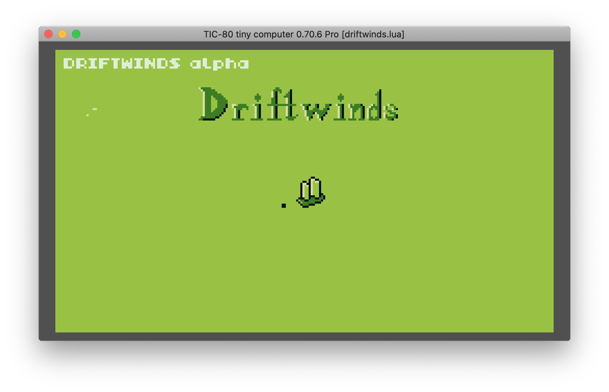

driftwinds
===

a very WIP game for tic80 with the visual aesthetic of the GBC where player
controlled ships can attack each other and enemies by driftboosting

Setting up the development environment
---
* Download TIC-80 pro (I can help with the pro)
* Open TIC-80
* `add driftwinds.lua`
* `load driftwinds.lua`
* ⌘R `run`, `edit`
* F1-5 to switch editors in edit mode
